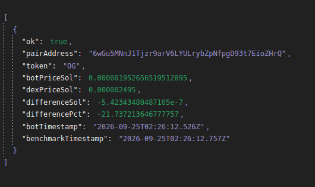
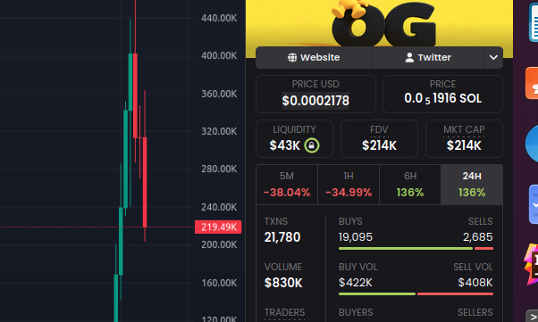

# Solana RPC Price Engine

A small n8n workflow for pulling Solana liquidity pool balances directly through RPC and calculating token prices from the pool reserves.

The goal is to get price data directly from on chain pool state instead of relying only on third party price APIs.

## Benchmark Example

One of the main advantages of calculating price directly from Solana pool reserves is speed. The engine reads the current on-chain pool state directly instead of waiting for a third-party pricing API to refresh.

In this benchmark, the two prices were captured only **231 ms apart**:

```text
Bot Price:        0.0000019527 SOL
Dexscreener API:  0.0000024950 SOL
Difference:       -21.74%

Bot Timestamp:        02:26:12.526
Benchmark Timestamp:  02:26:12.757
```

Despite being measured essentially at the same moment, my bot had already detected the much lower price directly from the pool reserves while the Dexscreener API was still returning the older, higher value.

This is the main advantage of the engine: it reacts directly to changes in the underlying pool instead of relying on a cached or delayed external price feed.

The screenshots below make this very clear. During the steep price drop, my bot had already reflected the lower price while the Dexscreener API was still behind. The same delay is also clearly visible on the Dexscreener GUI, where the displayed price was still catching up to the move my bot had already detected.

For latency-sensitive trading, this difference matters. A system relying on an external API can be reacting to stale market data while the underlying on-chain state has already changed significantly.





## Why I built it

Price APIs can be delayed, cached, or updated slower than the underlying pool.

This workflow reads token vault balances directly from Solana RPC, calculates the token's MEME/SOL price from the reserves, and then converts that price to USD using SOL/USD data from Dexscreener.

It also includes a paper trading system so price movement can be tested against take-profit and stop-loss conditions without executing real trades.

## Features

- Track multiple Solana pair addresses
- Automatically find pool token vault accounts
- Pull both token balances in a single RPC call
- Calculate token price from liquidity pool reserves
- Pull SOL/USD pricing from Dexscreener
- Convert MEME/SOL pricing into USD
- Simulate paper trades
- Take-profit and stop-loss logic
- Fee and slippage scenarios
- Shared bankroll across tracked pairs
- Track profit/loss and open positions

## How it works

The workflow first uses the pair address to find the relevant token vault accounts.

It then pulls both vault balances together using Solana RPC so both reserves come from the same snapshot.

The token price is calculated using:

```text
MEME/SOL price = SOL reserve / MEME reserve
```

The workflow then gets the current SOL/USD price from Dexscreener and converts the token price to USD.

## How to Use

1. Import the workflow JSON into n8n.
2. Add your Helius API key.
3. Add your wallet public key.
4. Add the Solana pair addresses you want to track to the watchlist.
5. Keep `activeTrading = false` and `mode = "paper"` while testing.
6. Run the workflow.

The bot will automatically find the pool vaults, calculate the token price from on-chain reserves, convert it to USD, and simulate the paper trade.

## Paper Trading

The workflow currently runs in paper trading mode.

You can configure:

- Starting bankroll
- Buy amount
- Profit target
- Stop loss
- Fee assumptions
- Slippage assumptions

The bot tracks the current position value, profit/loss, open positions, and available portfolio cash.

## Price Source

The token price itself is calculated from the pool's on-chain reserves.

Dexscreener is currently used for the SOL/USD conversion.

## Requirements

- n8n
- Helius RPC API key
- Solana pair addresses
- Internet connection

## Notes

This project is experimental and is intended for testing RPC-based pricing, paper trading logic, and comparing on-chain prices against external price sources.

Do not commit real API keys or sensitive wallet information to GitHub.

## Disclaimer

This project is for educational and testing purposes only.

It does not provide financial advice and should not be used with real funds without additional testing, validation, and security review.
